# Grupo 25

Projeto Integrador III Senac - Grupo 25.

- O protótipo foi feito na ferramenta [Figma\*](https://www.figma.com/file/PzAcLMEwfxA1lesZVX1l7K/Projeto-Integrador?type=design&node-id=0-1&mode=design&t=bYldgHHhLABz8Zgc-0).
- Há 3 tipos de usuário nessa sistema:
  - [Aluno](#aluno)
  - [Professor](#professor)
  - [Fornecedor](#fornecedor)

## Aluno

**Login**

**Área do Aluno**
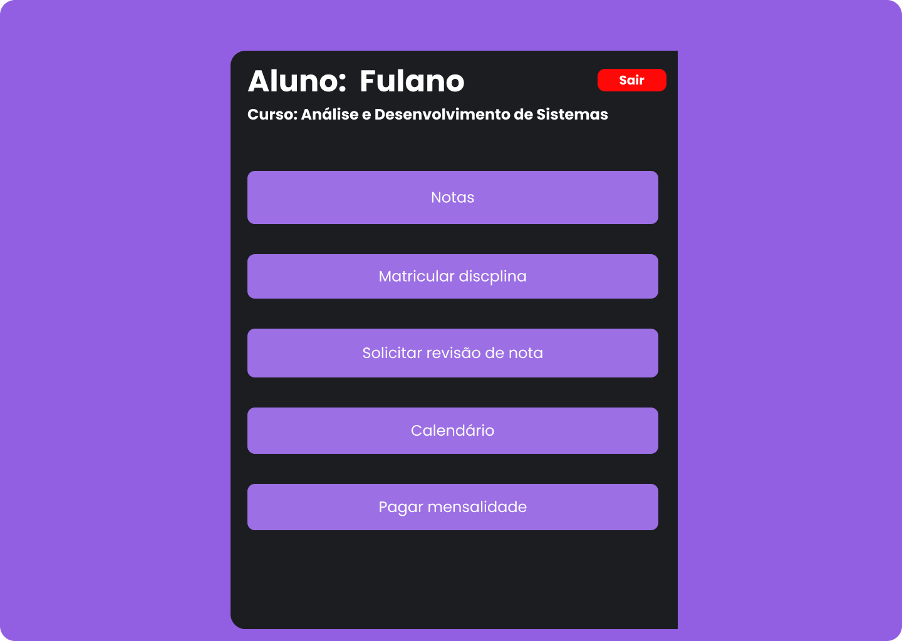

**Notas**
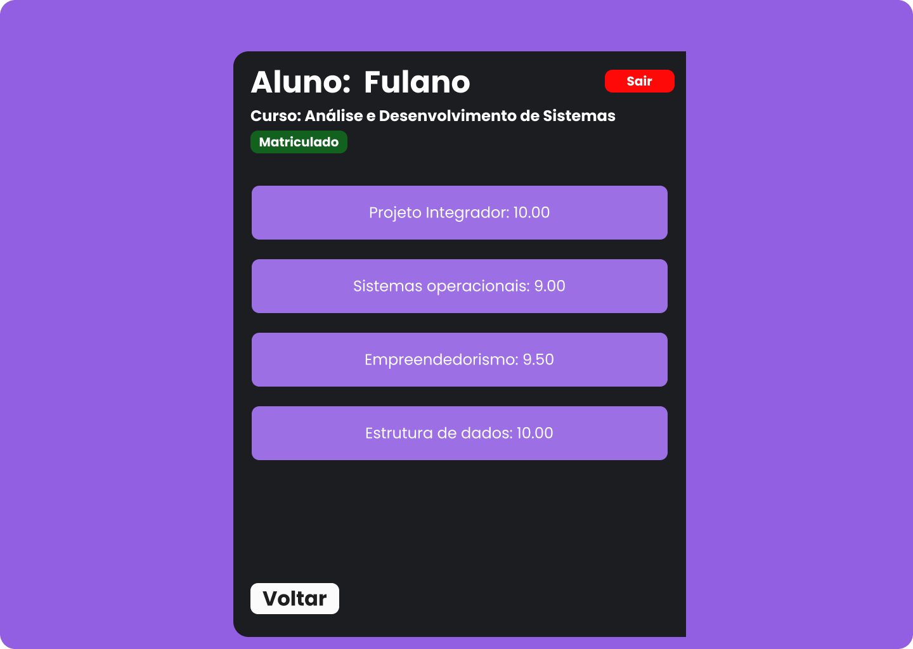

**Matrícula**
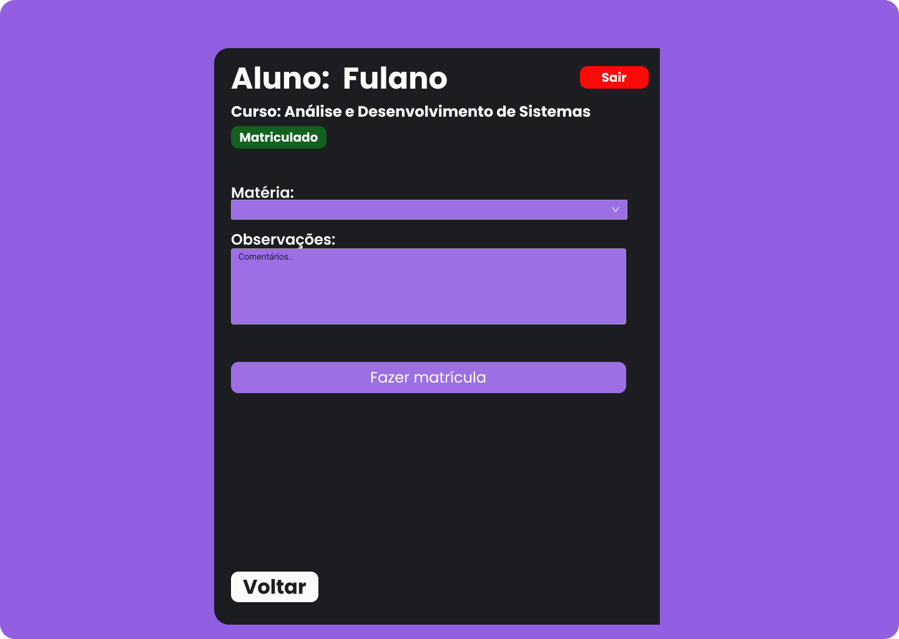

**Solicitar revisão de nota**
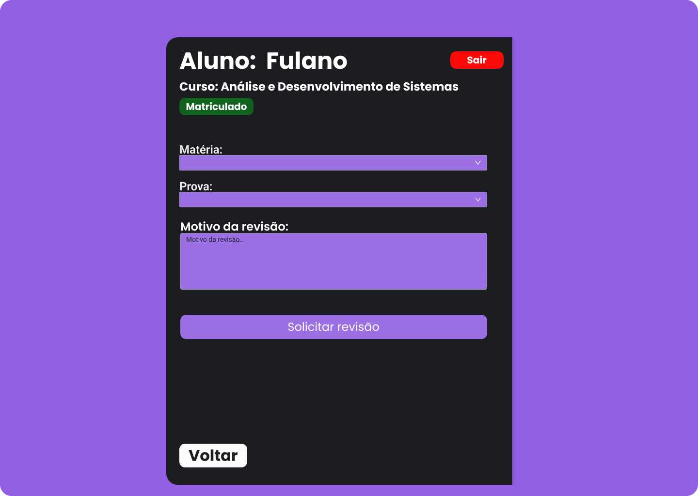

**Calendário**
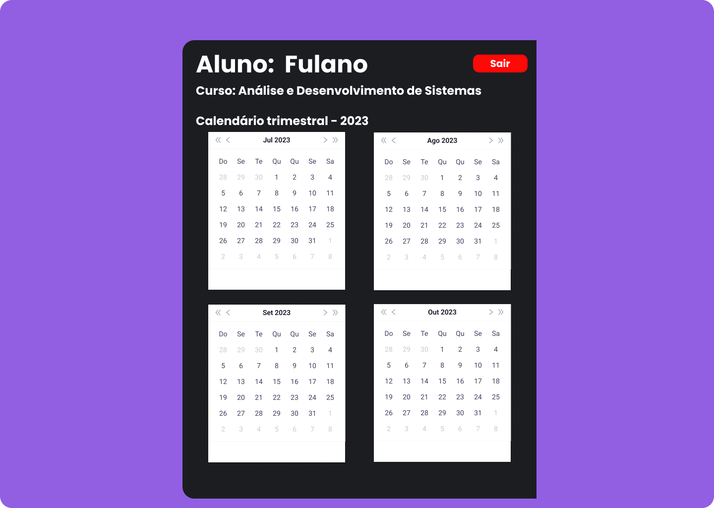

**Pagar mensalidade**
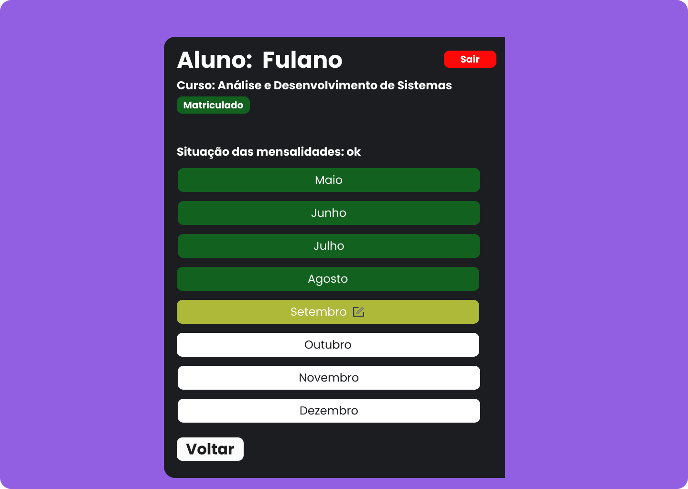

## Professor

**Login**

**Área do Professor**

**Registrar notas**
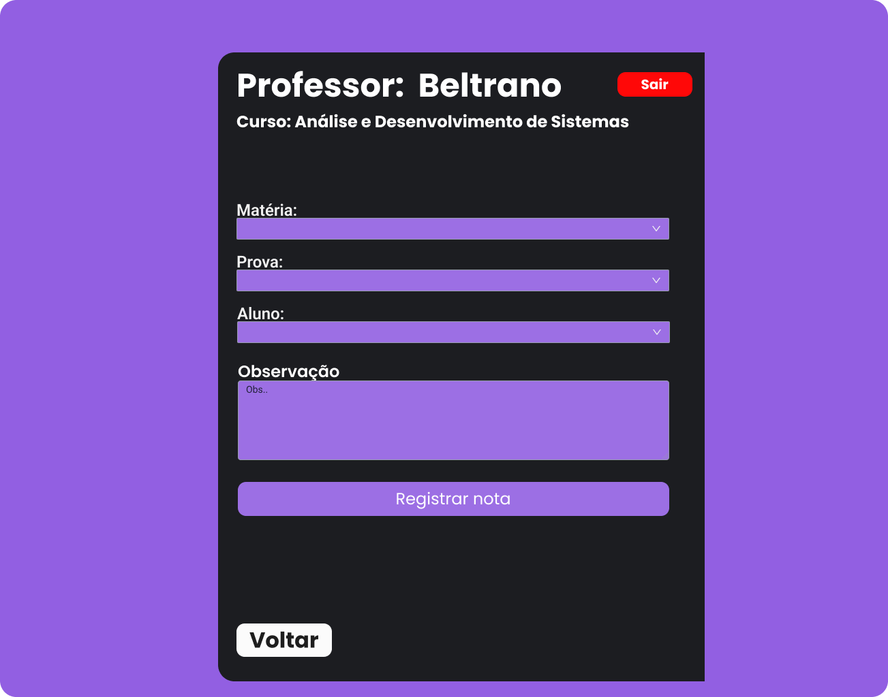

**Agendar aulas**
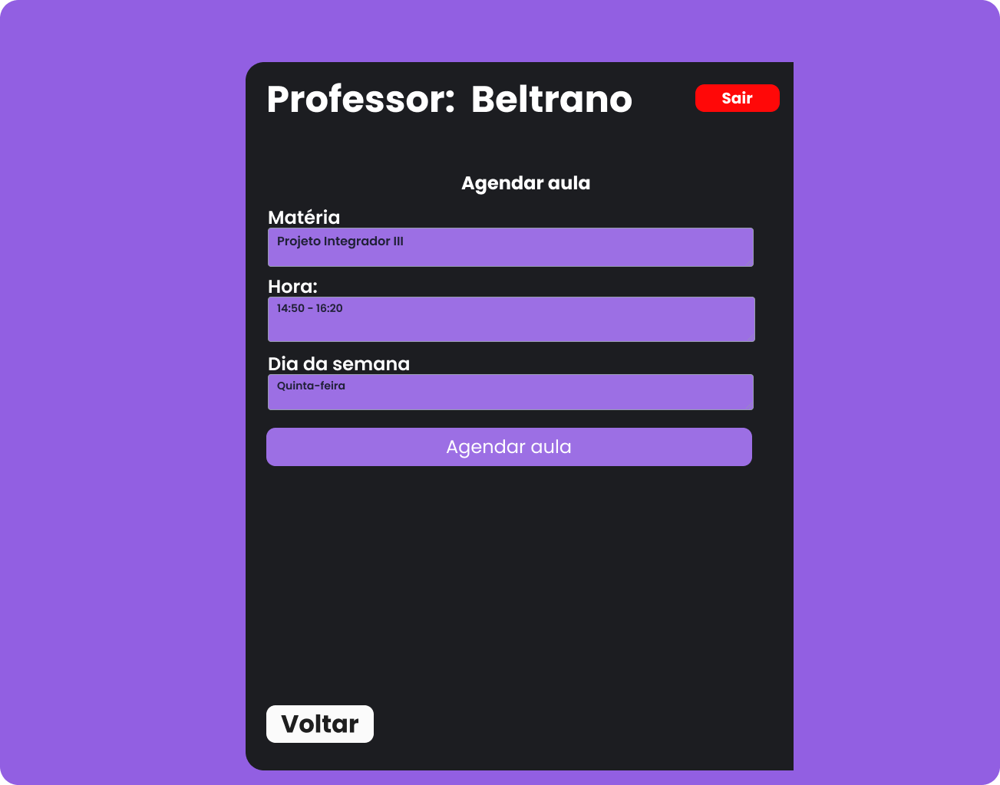

**Aprovar solicitação de revisão**

**Calendário**
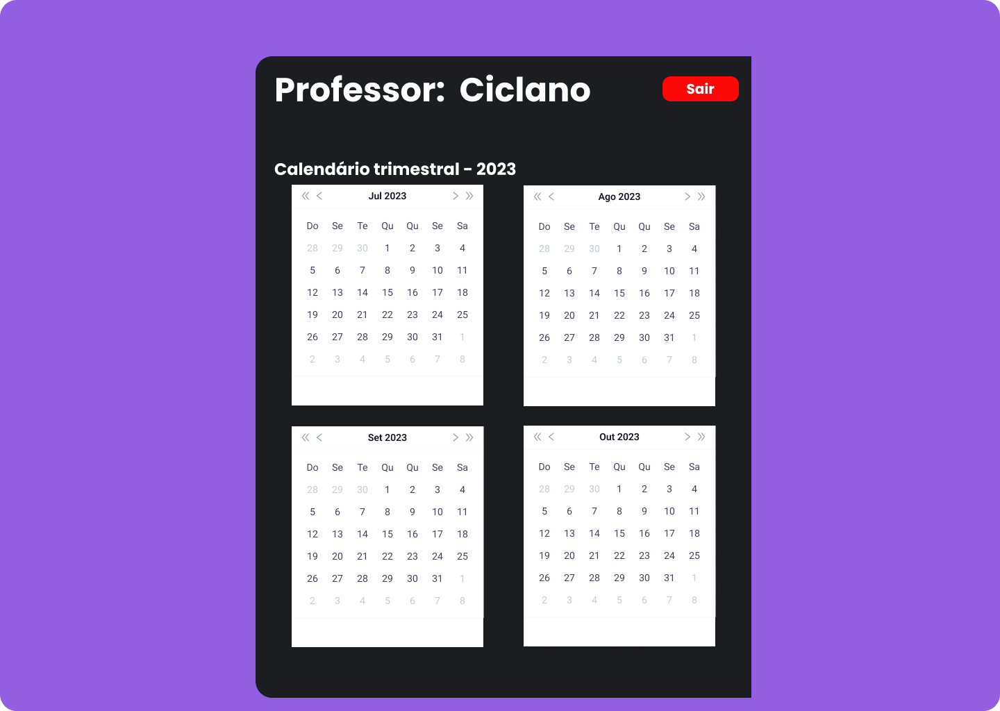

## Fornecedor

**Login**
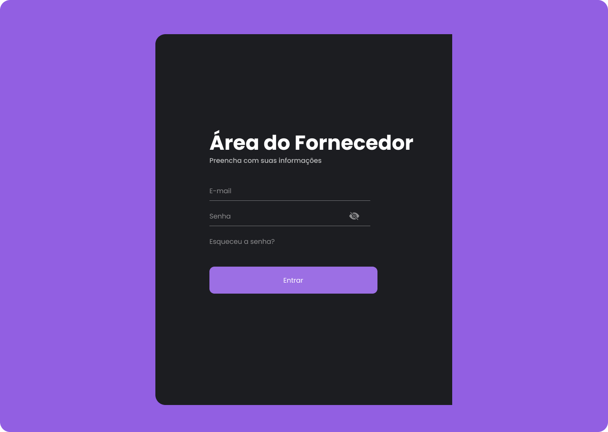

**Área do Fornecedor**
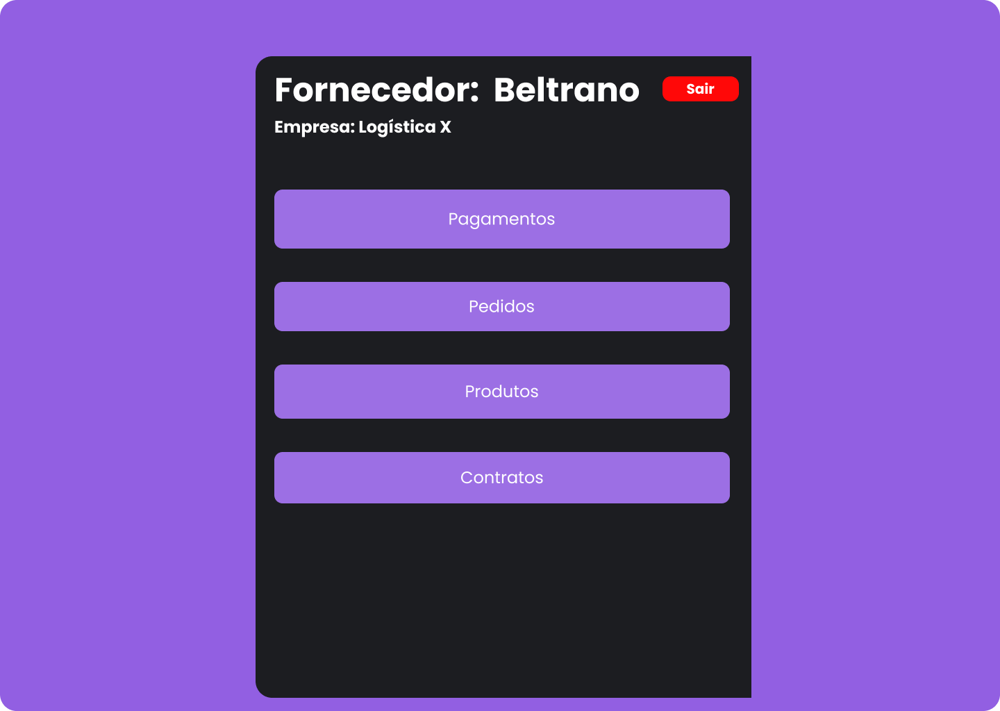

**Pagamentos**
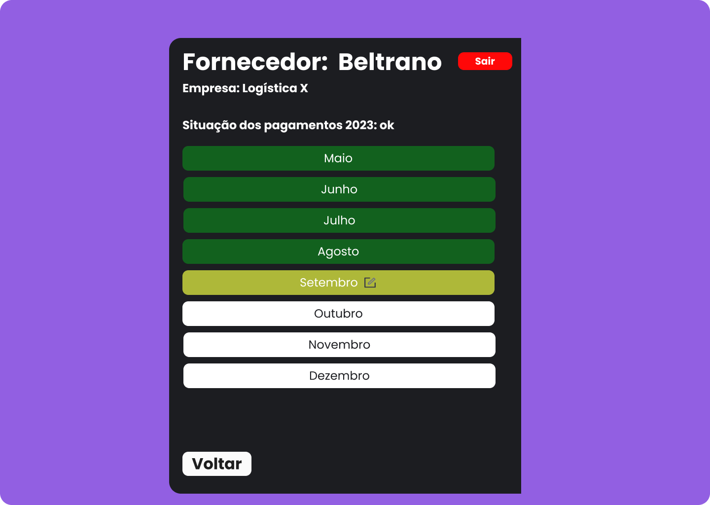

<!-- **Pedidos**
 -->

**Produtos**
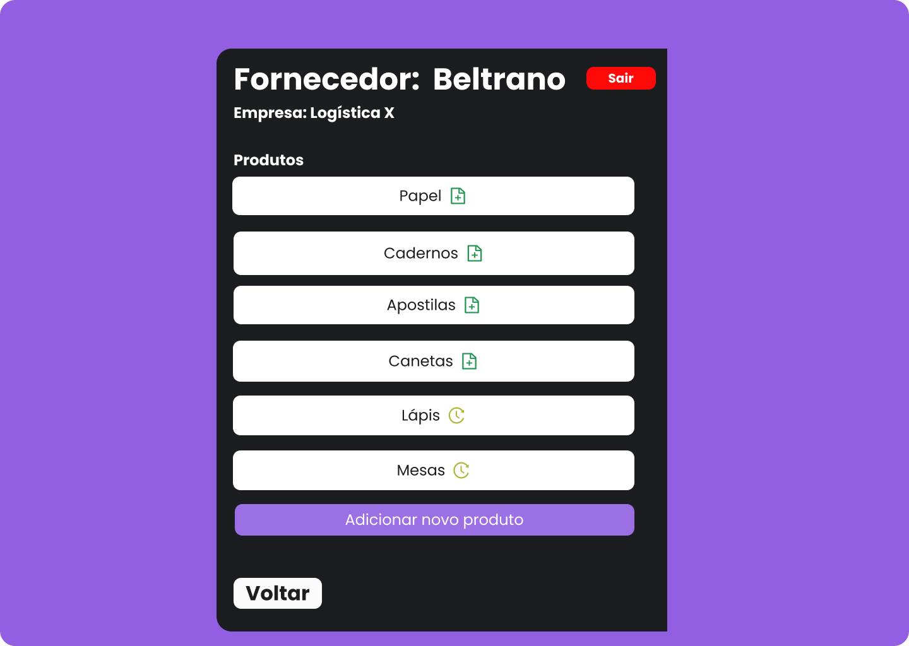

**Contratos**
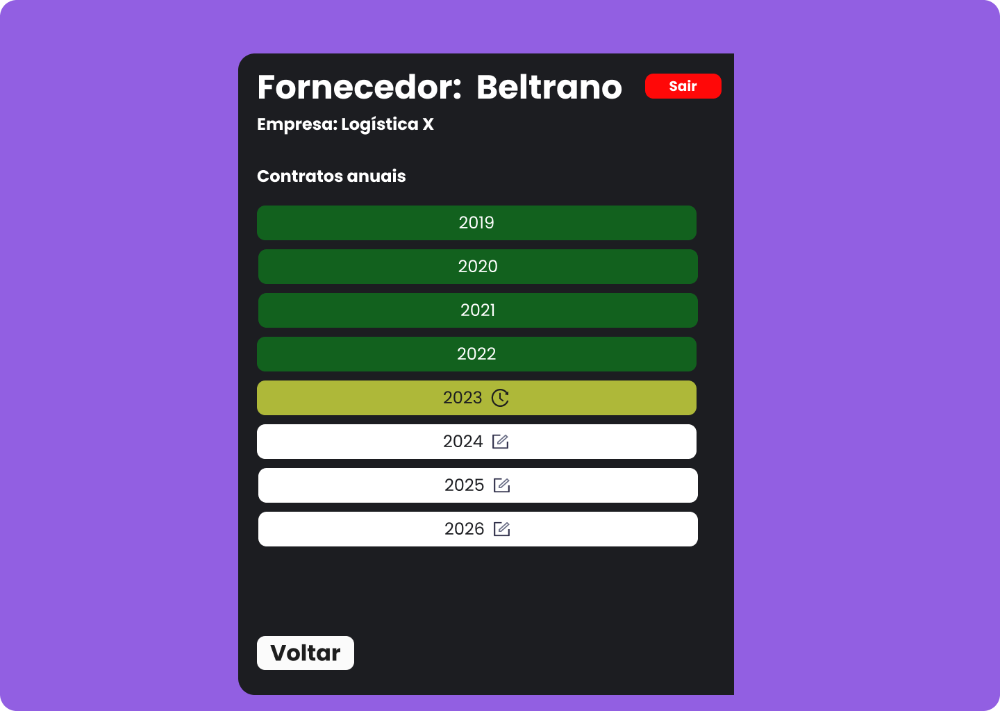
